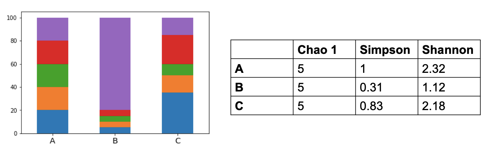

<!-- .slide: data-background="#3F51B5" class="dark" -->

### Intro to microbiome data visualization

**Claire Duvallet**

Microbiome Hack 2019

Cornell University

Slides: [cduvallet.github.io/mbiome-data-viz](https://cduvallet.github.io/mbiome-data-viz/)

---

<!-- .slide: data-background="#767171" class="dark" -->

### Who am I?

- Former PhD student in Eric Alm's lab at MIT    
- Future data scientist at Biobot Analytics

_almlab.mit.edu | www.biobot.io_

---

<!-- .slide: data-background="#767171" class="dark" -->

### Why this talk?

- Encourage you to dig into your data
- Provide starting examples and tools to continue learning about data viz
- Go through real-world visualizations

---

<!-- .slide: data-background="#767171" class="dark" -->

### 1. Looking at your raw data
### 2. Exploring your processed data
### 3. Visualizing your data

---

<link href="https://afeld.github.io/emoji-css/emoji.css" rel="stylesheet">

Most important data viz tools:

:eyes: and <i class="em em-brain"></i>

---

<!-- .slide: data-background="#767171" class="dark" -->

## Looking at your raw data

----

Crucial core concept:

_Most things in bioinformatics are text files_

:spiral_note_pad:

----

Note: https://twitter.com/popgengoogling/status/1108372032339800064

----

**DNA sequences**: fasta or fastq    

**OTU tables**: tab- or comma-delimited    
_biom files are text files too_

**QIIME 2 artifacts**: zip files containing text files     
`unzip artifact.qza`

----

`less` is your friend!

<insert gif of using less>

\*_`grep` is also great_

----

Many specialized tools and scripts to interact with raw data:

* QIIME 2 View
* FastQC
* Scott's `caravan` scripts: [github.com/swo/caravan/tools](https://github.com/swo/caravan/tree/master/tools)

_But just looking at the raw files gets you ~90% of the way_

---

<!-- .slide: data-background="#767171" class="dark" -->

### ~~1. Looking at your raw data~~
### 2. Exploring your processed data
### 3. Visualizing your data

---

<!-- .slide: data-background="#767171" class="dark" -->

<link href="https://afeld.github.io/emoji-css/emoji.css" rel="stylesheet">

## Exploring your data

1. Good sanity checks
2. Basic microbiome analyses
3. Using your <i class="em em-brain"></i>

----

<!-- .slide: data-background="#767171" class="dark" -->

## Good sanity checks

Know and trust your data before you start!

----

* All your samples are there?
* Reads per sample
* Reads per OTU
* Does it look like a stool sample?

Note: also can use diversity as a proxy for things that went really bad. i.e. if you only see one bug, prob a contaminant.

----

Stool samples should have at least ~10,000 reads each

----

OTUs are usually very sparse

---

<!-- .slide: data-background="#767171" class="dark" -->

<link href="https://afeld.github.io/emoji-css/emoji.css" rel="stylesheet">

## Exploring your data

1. ~~Good sanity checks~~
2. Basic microbiome analyses
3. Using your <i class="em em-brain"></i>

----

<!-- .slide: data-background="#767171" class="dark" -->

## Basic microbiome analyses

Good places to start (but not usually to finish)

Note: we'll be thinking through ways to visualize these later, so keep it in mind.

----

### Alpha diversity

_How diverse is the community in each sample?_

----

### Beta diversity & PCA

_How different are all the samples from each other?_

----

### Differential abundance

_Are any taxa differently abundant between condition A and B?_

----

### Differential abundance

### \*and variability

 _Martin, Witten, and Willis (2019)._

 _http://arxiv.org/abs/1902.02776_

----

### Correlation with a metadata variable

_Is BMI correlated with abundance of taxa X?_

_Is alpha diversity correlated with age?_

Note: fun game: http://guessthecorrelation.com/

----

Always look at the raw data!

Note: source is https://github.com/janhove/cannonball

----

### Correlation between taxa

_Is taxa X correlated with taxa Y?_

_Be careful of compositional effects! Use methods like SparCC or SPIEC-EASY._

----

### Prediction

_Can the microbiome predict a certain metadata variable?_

---

<!-- .slide: data-background="#767171" class="dark" -->

<link href="https://afeld.github.io/emoji-css/emoji.css" rel="stylesheet">

## Exploring your data

1. ~~Good sanity checks~~
2. ~~Basic microbiome analyses~~
3. Using your <i class="em em-brain"></i>

----

<!-- .slide: data-background="#767171" class="dark" -->

<link href="https://afeld.github.io/emoji-css/emoji.css" rel="stylesheet">

## Don't forget to use your <i class="em em-brain"></i>!

Data exploration can lead to new hypotheses!

----

Lung data: where to put your sample read cutoff?

NOte: Lung example (where are you gonna put your reads cutoff? can't just use same values as for poop)

----

Stomach vs. throat bacteria?

Note: clinical collaborator wanted to identify "stomach" bacteria but this was difficult for a lot of reasons, mostly that everything in the throat is also in the stomach. Led us to a different analysis approach, looking at beta-diversity between these communities. But it also eventually led us to an interesting discovery...

----

Eventually led us to an interesting discovery...

Note: we'll pick apart this figure later.

----

Also: pay attention to what your data is trying to tell you

Hsiao et al, _Nature_ 2014. doi:10.1038/nature13738

Note: Hsiao et al example (PCA plot showed me something funky)

----

----

---

<!-- .slide: data-background="#767171" class="dark" -->

### ~~1. Looking at your raw data~~
### ~~2. Exploring your processed data~~
### 3. Visualizing your data

---

<!-- .slide: data-background="#767171" class="dark" -->

## Visualizing your data

1. Basic plot types
2. Different viz for different purposes
3. Microbiome visualization tools
4. Examples from literature and Biobot

----

<!-- .slide: data-background="#767171" class="dark" -->

## Basic plot types

_What kind of data do you have?_

_What do you want to show?_

----

### Kinds of data

* Categorical (ordinal or not)
* Numeric (discrete or continuous)

Note: continuous includes dates, percentages/proportions

----

### Some things you can show

**Distributions**: "what sorts of values does this one variable take?"     

**Relationships**: "what happens to y when x changes?"

**Comparisons**: "which one is bigger?"

----

### Distributions

_What sorts of values does this one variable take?_

Histograms (usually)

Frequency bar plots (for categorical data)

<show an image of histogram on the left, frequency bar plot on the right>

Note: distributions are good for showing relative abundances of single OTUs, alpha diversity

----

### Relationship between two variables

_What happens to y when x changes?_

Scatter plot (almost always)   

Boxplot (if one variable is categorical)    

----

### Relationship between more than two variables

_What happens to y when x changes?_

Scatter plot with additional encoding (color, shape)      
Facets (AKA small multiples)       

----

### Paired data

_What happens to the "same" y when x changes?_

Scatter plot or slope graph       

Boxplot of differences or MA-plot             

Note: Paired data is when the two measurements belong to the same thing. So, for example, the abundance of an OTU in _the same mouse_ at two times points. slope graph is for when you're comparing the same data at different time points and for a relatively small number of comparisons. It also emphasizes the _direction_ of the change rather than the magnitude (show example from Rafa's ch11 book).

----

### Comparisons

_Which one is bigger?_

**Most comparisons**: boxplots and/or stripplots        
**Single values**: bar plots      
**Temporal**: line plots      
**High-dimensional**: heatmaps      
**Distributions**: ridge plots or violin plots      

Note: I think of relationship as "if x increases, what happens to y?" and comparisons as "which one is bigger?" -- but they're quite similar concepts so don't worry about the distinction too much. Bar plots: because they rely on the length of the bars to encode data, you must start the bars at zero.

----

Examples of each type:

boxplot/stripplot: show all three, alpha div vs. obesity

single values: just for giggles, show my sample size comparison

temporal:

----

### Compositions

_What's this made up of?_

Stacked bar plot
Pie chart (but only if you are showing few things and you're _really_ sure about it)

---

### Basic principles for data visualization

----

# Show the data!

https://www.autodeskresearch.com/publications/samestats

Note: there's really only one basic principle. For pretty visualizations, this can be relaxed a little bit -- but you still always need to make sure your data is reliably represented and adds something to the viz.

----

# Remember your audience

# Communicate "what's the point"

----

### Many other principles for

* color, opacity, shapes, and size of points
* annotations and size of plot decorators
* order and size of things you're presenting

Read more: github.com/cduvallet/mbiome-data-viz/refs

Note: these are also things you tweak to change your message.

---

<!-- .slide: data-background="#767171" class="dark" -->

## Visualizing your data

1. ~~Basic plot types and principles~~
2. Different viz for different questions and audiences
3. Microbiome visualization tools
4. Examples from literature and Biobot

----

## Different visualizations answer different questions

----

Heatmaps sorted by phylogeny provide broad overview and reveal few patterns.

Duvallet et al, _Nature Communications_ 2017

----

Heatmaps sorted by direction of effect reveal strong disease-specific patterns.

----

### Stacked bar plots vs. line plots vs. heatmap: what does each one highlight?

24-hour sampling of residential sewage.

----

----

----

----

### Similar data, different conclusions

Both figures enable comparison of JSD between on and off PPI patients, but one explicitly highlights it.

Note: I wanted to make the point that this data is "meh" so I showed the correlation plot. The boxplot condenses it

----

----

----

## Different viz for different audiences

- my meta-analysis in the paper, in a semi-technical presentation, and in a non-technical presentation

- show my bar chart (basically go through my whole paper and show how i give the talk for it. maybe pull other stuff from my defense too)

- link to comm lab article

---

<!-- .slide: data-background="#767171" class="dark" -->

## Visualizing your data

1. ~~Basic plot types and principles~~
2. ~~Different viz for different questions and audiences~~
3. Microbiome visualization tools
4. Examples from literature and Biobot

----

## Visualization tools

- python, R, MATLAB
- Tableau, D3, etc
- Interactive: Bokeh, R Shiny, etc
- Microbiome-specific: Calour, Anvio, QIIME 2 View, ITOL

---

<!-- .slide: data-background="#767171" class="dark" -->

## Visualizing your data

1. ~~Basic plot types and principles~~
2. ~~Different viz for different questions and audiences~~
3. ~~Microbiome visualization tools~~
4. Examples from literature and Biobot

---

My heatmaps

---

Then link to the part of figure 1 where I show the percent which are higher in cases vs. controls

---

Smillie's donor/patient prediction tree

---

Reconstitution of the gut microbiota of antibiotic-treated patients by autologous fecal microbiota transplant
- fig 3 tsne plot
    - point out the use of color to encode high vs. low diversity. what other ways could they have done this?
    - what about the color-coding, what do you think about that? how else could they have done it?
- fig 3 (?) small multiples of trajectories
    - the point of this figure is supposed to be: auto-FMT patients consistently regained diversity (even if they weren’t the same as their initial sample); no-FMT controls did not
    - what are some things that make this clear? unclear?
        - clear: highlighting the start and end with color
        - unclear: background blob colors. connecting the start and end with a bold line. adding the percent on top of each plot (should be a separate bar plot, probably)
- fig ... heatmaps
    - main takeaway? (top three plots go from dark to light back to dark; bottom three go from dark to light and stay light)
    - what is all the info encoded on here?
        - diversity: why did they categorize this? should be a gradient with the raw values
        - similarity: same, should not categorize this. adds noise and hides data.
        - color coding microbial species: i'm torn on this one. but problem is that there's no legend so not great.
    - how else could they show this data? can we draw out a schematic of what it would look like?

Or the one with different contributions to variance in mcirobiome (i think still eran segal, the one where environment plays (Environment dominates over host genetics in shaping human gut microbiota) - shows good and bad use of color [making it pretty is not always the right thing to do])

---

Biobot's report

- what do officials want to know? do they care about non-fatal OD's, or non-fatal OD's vs. narcan use? do they want to see info about each community, or do they just know already?
- public health officials: need to show data (via tables) but also condense it (via viz). have to find a balance
