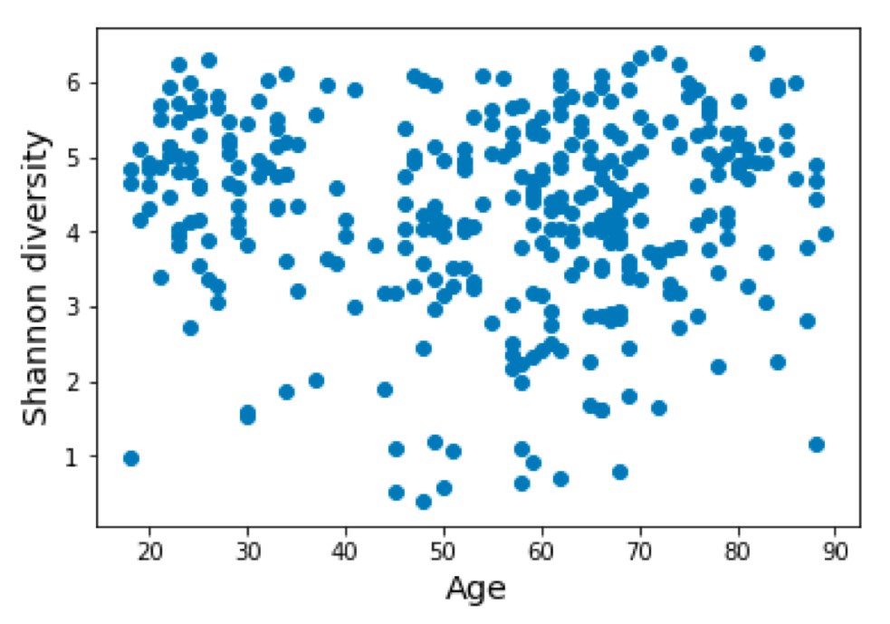
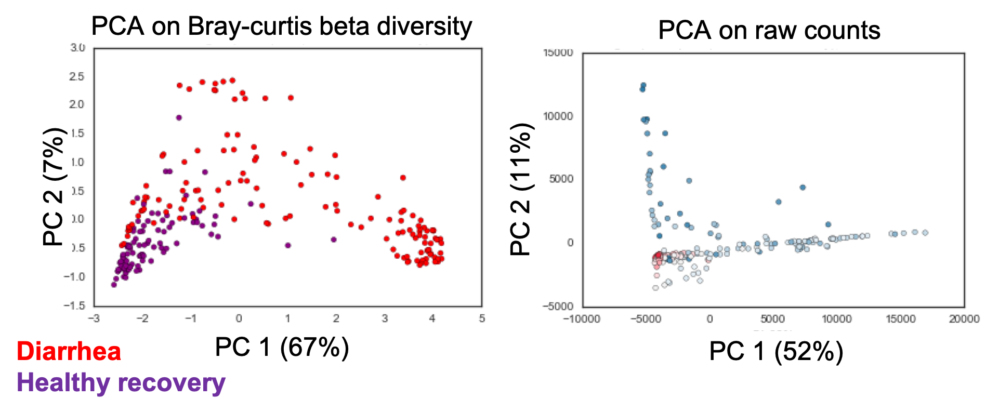

<!-- .slide: data-background="#3F51B5" class="dark" -->

### Looking at your data:

#### _Intro to microbiome data visualization_

#### Claire Duvallet

Microbiome Hack 2019

Cornell University

---

<!-- .slide: data-background="#767171" class="dark" -->

### Who am I?

- Former PhD student in Eric Alm's lab at MIT    
- Future data scientist at Biobot Analytics

_almlab.mit.edu | www.biobot.io_

---

<!-- .slide: data-background="#767171" class="dark" -->

### 1. Looking at your raw data
### 2. Exploring your processed data
### 3. Visualizing your data

---

<link href="https://afeld.github.io/emoji-css/emoji.css" rel="stylesheet">

Most important data viz tools:

:eyes: and <i class="em em-brain"></i>

---

<!-- .slide: data-background="#767171" class="dark" -->

## Looking at your raw data

----

Crucial core concept:

_Most things in bioinformatics are text files_

:spiral_note_pad:

----


Note: https://twitter.com/popgengoogling/status/1108372032339800064

----

**DNA sequences**: fasta or fastq    

**OTU tables**: tab- or comma-delimited    
_biom files are text files too_

**QIIME 2 artifacts**: zip files containing text files     
`unzip artifact.qza`

----

`less` is your friend!

<insert gif of using less>

\*_`grep` is also great_

----

Lots of specialized tools and scripts to interact with raw data

* QIIME 2 View
* Scott's `caravan` scripts: [github.com/swo/caravan/tools](https://github.com/swo/caravan/tree/master/tools)
* FastQC

----


Note: but just looking at the raw files gets you like 90% of the way

---

<!-- .slide: data-background="#767171" class="dark" -->

### ~~1. Looking at your raw data~~
### 2. Exploring your processed data
### 3. Visualizing your data

---

<!-- .slide: data-background="#767171" class="dark" -->

<link href="https://afeld.github.io/emoji-css/emoji.css" rel="stylesheet">

## Exploring your data

1. Good sanity checks
2. Basic microbiome analyses
3. Using your <i class="em em-brain"></i>

----

<!-- .slide: data-background="#767171" class="dark" -->

## Good sanity checks

Know and trust your data before you start!

----

* All your samples are there?
* Reads per sample
* Reads per OTU
* Does it look like a stool sample?

Note: also can use diversity as a proxy for things that went really bad. i.e. if you only see one bug, prob a contaminant.

----


----

Raw data


No singletons


Note: Microbiome data is usually very sparse.

---

<!-- .slide: data-background="#767171" class="dark" -->

<link href="https://afeld.github.io/emoji-css/emoji.css" rel="stylesheet">

## Exploring your data

1. ~~Good sanity checks~~
2. Basic microbiome analyses
3. Using your <i class="em em-brain"></i>

----

<!-- .slide: data-background="#767171" class="dark" -->

## Basic microbiome analyses

Good places to start (but not usually to finish)

Note: we'll be thinking through ways to visualize these later, so keep it in mind.

----

### Alpha diversity

_How diverse is the community in each sample?_


----

### Beta diversity & PCA

_How different are all the samples from each other?_


----

### Differential abundance

_"Are any taxa differently abundant between condition A and B?"_


----

### Differential abundance

### \*and variability


 _Martin, Witten, and Willis (2019)._

 _http://arxiv.org/abs/1902.02776_

----

### Correlation with a metadata variable

_Is BMI correlated with abundance of taxa X?_

_Is alpha diversity correlated with age?_



Note: fun game: http://guessthecorrelation.com/

----

Always look at the raw data!


Note: source is https://github.com/janhove/cannonball

----

### Correlation between taxa

_Is taxa X correlated with taxa Y?_


_Be careful of compositional effects! Use methods like SparCC or SPIEC-EASY._

----

### Prediction

_Can the microbiome predict a certain metadata variable?_


---

<!-- .slide: data-background="#767171" class="dark" -->

<link href="https://afeld.github.io/emoji-css/emoji.css" rel="stylesheet">

## Exploring your data

1. ~~Good sanity checks~~
2. ~~Basic microbiome analyses~~
3. Using your <i class="em em-brain"></i>

----

<!-- .slide: data-background="#767171" class="dark" -->

<link href="https://afeld.github.io/emoji-css/emoji.css" rel="stylesheet">

## Don't forget to use your <i class="em em-brain"></i>!

Data exploration can lead to new hypotheses!

----

Where will you put your sample read cutoff?


NOte: Lung example (where are you gonna put your reads cutoff? can't just use same values as for poop)

----

Stomach vs. throat bacteria?


Note: clinical collaborator wanted to identify "stomach" bacteria but this was difficult for a lot of reasons, mostly that everything in the throat is also in the stomach. Led us to a different analysis approach, looking at beta-diversity between these communities. But it also eventually led us to an interesting discovery...

----

Eventually led us to an interesting discovery...


Note: we'll pick apart this figure later.

----



Hsiao et al, _Nature_ 2014. doi:10.1038/nature13738

Note: Hsiao et al example (PCA plot showed me something funky)

----


----


---

<!-- .slide: data-background="#767171" class="dark" -->

### ~~1. Looking at your raw data~~
### ~~2. Exploring your processed data~~
### 3. Visualizing your data

---

<!-- .slide: data-background="#767171" class="dark" -->

## Visualizing your data

1. Basic plot types and principles
2. Different viz for different questions and audiences
3. Microbiome visualization tools
4. Examples from literature and Biobot

---

<!-- .slide: data-background="#767171" class="dark" -->

## Basic plot types

---

_What kind of data do you have?_

_What do you want to show?_

---

Kinds of data:

* Categorical (ordinal or not)
* Numeric (discrete or continuous)

Note: continuous includes dates, percentages/proportions

---

Things you can show:

* Distributions: "what sorts of values does this one variable take?"
* Relationships: "what happens to y when x changes?"
* Comparisons: "which one is bigger?"
* Connections: "which ones go together?"

---

### Distributions

Histograms (usually)
Frequency bar plots (for categorical data)

<show an image of histogram on the left, frequency bar plot on the right>

---

### Relationships between two variables

Scatter plot (almost always)    
Boxplot (if one variable is categorical)    

<image: alpha diversity vs. BMI; alpha diversity vs. obese status>

---

#### Showing paired data

Scatter plot
Slope graph (to emphasize direction of shift)
MA-plot (rarely, but useful to combine change with mean abundance)

Note: slope graph is for when you're comparing the same data at different time points and for a relatively small number of comparisons. It also emphasizes the _direction_ of the change rather than the magnitude (show example from Rafa's ch11 book).

---

### Relationships between more than two variables

Scatter plot with additional encoding (color, shape)
Facets (AKA small multiples)

<image: reflux vs gastric-lung JSD with aspiration status encoded>

---

<example of a small multiples plot (need to think of microbiome examples)>

---

### Comparisons

**Most comparisons**: boxplots and/or stripplots
**Single values**: bar plots     
**Temporal**: line plots
**High-dimensional, highligh relative changes**: heatmaps
**Distributions**: ridge plots or violin plots

Note: I think of relationship as "if x increases, what happens to y?" and comparisons as "which one is bigger?" -- but they're quite similar concepts so don't worry about the distinction too much. Bar plots: because they rely on the length of the bars to encode data, you must start the bars at zero.

---

Examples of each type:

boxplot/stripplot: show all three, alpha div vs. obesity

single values: just for giggles, show my sample size comparison

temporal:

---

### Compositions

Stacked bar plot
Pie chart (but only if you have 3 or fewer things and you're _really_ sure about it)
Tree chart (I don't know how to make these tbh)

---

### Connections

Circos plots
Networks (need to prune and think critically about interpretation)

---

### Basic principles for data visualization

---

# Show the data!

<ancombe's quartet>

---

### Many other principles for

* color, opacity, shapes, and size of points
* annotations and size of plot decorators
* order and size of things you're presenting

github.com/cduvallet/mbiome-data-viz/refs

---

<!-- .slide: data-background="#767171" class="dark" -->

## Visualizing your data

1. ~~Basic plot types and principles~~
2. Different viz for different questions and audiences
3. Microbiome visualization tools
4. Examples from literature and Biobot

---

## Different viz for different questions

- my meta-analysis
    - show the heatmaps sorted by "phylogeny" vs. by "blue-ness" and "red-ness"

- maybe: 24hr paper
    - show the overall heatmap (to give a sense of scale of data and overall noise)
    - vs. the line plots (to see the dynamics more clearly)

---

## Different viz for different audiences

- my meta-analysis in the paper, in a semi-technical presentation, and in a non-technical presentation

- link to comm lab article

---

<!-- .slide: data-background="#767171" class="dark" -->

## Visualizing your data

1. ~~Basic plot types and principles~~
2. ~~Different viz for different questions and audiences~~
3. Microbiome visualization tools
4. Examples from literature and Biobot

---

## Visualization tools

- python, R, MATLAB
- Tableau, D3, etc
- Interactive: Bokeh, Shiny, etc
- Microbiome-specific: Calour, Anvio, QIIME 2 View, ITOL

---

<!-- .slide: data-background="#767171" class="dark" -->

## Visualizing your data

1. ~~Basic plot types and principles~~
2. ~~Different viz for different questions and audiences~~
3. ~~Microbiome visualization tools~~
4. Examples from literature and Biobot

---

My heatmaps

---

Then link to the part of figure 1 where I show the percent which are higher in cases vs. controls

---

Smillie's donor/patient prediction tree

---

Maybe: Zeevi paper on glycemic response

Reconstitution of the gut microbiota of antibiotic-treated patients by autologous fecal microbiota transplant
- fig 3 tsne plot
    - point out the use of color to encode high vs. low diversity. what other ways could they have done this?
    - what about the color-coding, what do you think about that? how else could they have done it?
- fig 3 (?) small multiples of trajectories
    - the point of this figure is supposed to be: auto-FMT patients consistently regained diversity (even if they weren’t the same as their initial sample); no-FMT controls did not
    - what are some things that make this clear? unclear?
        - clear: highlighting the start and end with color
        - unclear: background blob colors. connecting the start and end with a bold line. adding the percent on top of each plot (should be a separate bar plot, probably)
- fig ... heatmaps
    - main takeaway? (top three plots go from dark to light back to dark; bottom three go from dark to light and stay light)
    - what is all the info encoded on here?
        - diversity: why did they categorize this? should be a gradient with the raw values
        - similarity: same, should not categorize this. adds noise and hides data.
        - color coding microbial species: i'm torn on this one. but problem is that there's no legend so not great.
    - how else could they show this data? can we draw out a schematic of what it would look like?

Or the one with different contributions to variance in mcirobiome (i think still eran segal, the one where environment plays)

Oh the nature microbiology paper with all the different media
And the different drug/bug effects

---

Biobot's report


---

<!-- .slide: data-background="#767171" class="dark" -->

## 1. Philosophy
## 2. Organization
## 3. Code

---

<!-- .slide: data-background="#3F51B5" class="dark" -->

## 1. Philosophies

---

### Philosophy 1

#### Everything I do, I do for me*

_\*future me, that is_

:heart_eyes_cat:

---

#### "What can I do to make future Claire love present Claire?"

Leave bread crumbs everywhere:
READMEs, comments, docs           

---

If you died in a bus crash tomorrow, how hard would it be to pick up the pieces?

:oncoming_bus:

If your computer dies the week of your defense, how long would it take you to get back up and running?

:scream:

---

### Philosophy 2

Grad school is a time to build skills and _grow_

:deciduous_tree:

---

#### What's in it for me?

In my PhD, I said yes to things that benefited me.

_Learning new skills, making connections, building good favor: all of it counts!_

#### Why am I doing what I'm doing?

Note: just make sure you're not doing something for nothing! this talk is an example! I wanted to learn this new presentation style, and write down my reflections on strategies that worked for posterity. Examples: almlab website --> learned xml and css sort of, microbiome club --> got infinite favors from eric

---

#### Also, if it would 20% additional effort to be useful to the rest of the world, do it

¯\\\_(ツ)\_/¯

Just seems like the right thing to do...

Note: also my brother tricked me into this one, slash I misinterpreted him.

---

<!-- .slide: data-background="#3F51B5" class="dark" -->

## 2. Organization

Projects     
Notes and files      
Data      

---

All of my repos are basically the same structure:

```shell
├── Makefile           
├── README.md        <- If you don't have a README
|                       did you even make a repo?
|
├── data             <- OTU tables (if small enough),
|                       QIIME 2 outputs, metadata excel
|                       files, trees, etc.
│
├── src              <- All code: scripts, notebooks, etc.
|
└── final            <- Final figures, supp files, tables.

```

---

#### data/

```shell
├── data
    ├── raw          <- Raw data in all of its
    |                   messy glory. NEVER CHANGE!
    |                   Raw data = outputs of processing,
    |                   e.g. original OTU table.
    ├── clean        <- Intermediate data that has
    |                   been cleaned up, e.g. OTU
    |                   table with low QC samples
    |                   removed.
    └── analysis     <- Outputs from analyses (e.g.
                        beta diversity, p-values, etc)
```

Some files will probably be too large to commit: **keep these backed up somewhere else!**

Note: can have other folders here too. Others I've had are qiime2-output, tree, etc. Also look into github large file storage

---

#### src/

```shell
├── src
    ├── data         <- Code used to wrangle and
    |                   clean data.
    |── exploration  <- Jumble of iPython notebooks
    |                   with preliminary work. Label
    |                   these by date + brief description.
    ├── analysis     <- Scripts used to produce files
    |                   in data/analysis/. For the most
    |                   part, Makefile calls these.
    ├── figures      <- Scripts to make figures.
    └── util         <- If you want, files with commonly
                        re-used functions
```

Iterative process between notebooks and scripts.

---

#### final/

```shell
├── final
    ├── figures      <- Where you save final png's,
    |                   also pushed to GitHub if you want.
    |── tables       <- If you're feeling ambitious,
    |                   markdown versions of tables
    └── supp_files   <- Files that would otherwise be
                        supplementary Excel files
```

Mostly for you to organize outputs.

---

Read more at Cookie Cutter data science:

https://drivendata.github.io/cookiecutter-data-science/

---

<!-- .slide: data-background="#3F51B5" class="dark" -->

## Organization

~~Projects~~       
Notes and files      
Data      

---

#### Make all notes and files human-readable and searchable

Anything "messy" starts with a date

Use delimiters creatively

`grep` is your best friend

---

#### There is only one correct way to write the date

# 2019-02-07

---

### It's not just me!


http://buff.ly/2wa5QXz

---


Note: this my notes folder. Lots of different sorts of things, not super organized (i.e. a human definitely did this), but really easy to grep for what I need.

---

Also, everything is on the cloud.

_(Remember the potential :scream:)_


---

<!-- .slide: data-background="#3F51B5" class="dark" -->

## Organization

~~Projects~~       
~~Notes and files~~      
Data      

---

# Never edit your raw data

---

#### Storing raw data

All data folders should have associated README: who, what, when, why, how?

Google drive and Dropbox are dangerous: who did what when?

---

#### Working with changing data

If files are small enough: version control with github

Otherwise, keep versions ... somehow?

_(I haven't figured a great system for this one out yet)_

---

<!-- .slide: data-background="#3F51B5" class="dark" -->

## 3. Coding

Makefiles     
Tidy data     

_Implementing these two concepts changed my life_

---

#### General idea behind make

To make a `target`, run the `rule` iff any of the `dependencies` are _newer_ than the target.

```shell
target: dependencies
    rule
```

---

```shell
make figure3.png
```


---

```shell
figure3.png: figure3.py disease_meta.txt core_bugs.txt
    python figure3.py --in_meta disease_meta.txt ...

disease_meta.txt: disease_meta.py qvalues.txt
    python disease_meta.py --qvals qvalues.txt \
        --out disease_meta.txt

qvalues.txt: qvalues.py otu.clean meta.clean
    python src/analysis/qvalues.py \
        --otu otu.clean --meta meta.clean ...
```

---

<link href="https://afeld.github.io/emoji-css/emoji.css" rel="stylesheet">

#### But why?

zomg reviewer comments zomg

<i class="em em-exploding_head"></i>

#### Also:

The code _is_ the documentation of what you did.

_(Remember: make future you love current you._ :heart\_eyes\_cat: )

Note: give example, latest paper wanted alpha diversity, which I had done but commented out. Now I know exactly what script to run and what inputs it requires.

---

<link href="https://afeld.github.io/emoji-css/emoji.css" rel="stylesheet">

#### Tidy data

Literally life-changing.

:panda_face: + <i class="em em-exploding_head"></i> = :nerd: :mortar_board:

---

#### In tidy data, each unique observation gets its own line

Tidyfied OTU table:

```shell
otu_id  sample_id   counts
otu1    s1          0.0
otu1    s2          16.0
otu1    s3          0.0
...     ...         ...
otu2    s1          1.0
otu2    s2          0.0
otu2    s3          20.0
...     ...         ...
```

Note: then you can add sample metadata, otu-metadata; easily group things together; easily make plots with libraries like seaborn

---

#### But why?

Query subsets of data

Merge data

Harness seaborn

_Just trust me_
_(and Nathaniel (and the #Rstats internet!))_

---

<!-- .slide: data-background="#3F51B5" class="dark" -->

## In conclusion...

### Do everything such that future you falls _madly in love_ with present you

Note: Think of your computational PhD as an act of radical self-love

---

## Thanks for listening!


Note: source = https://nightowlmom2.wordpress.com/category/soapbox/

---

Claire Duvallet

[cduvallet.github.io](cduvallet.github.io)

[@cduvallet](https://twitter.com/cduvallet)
